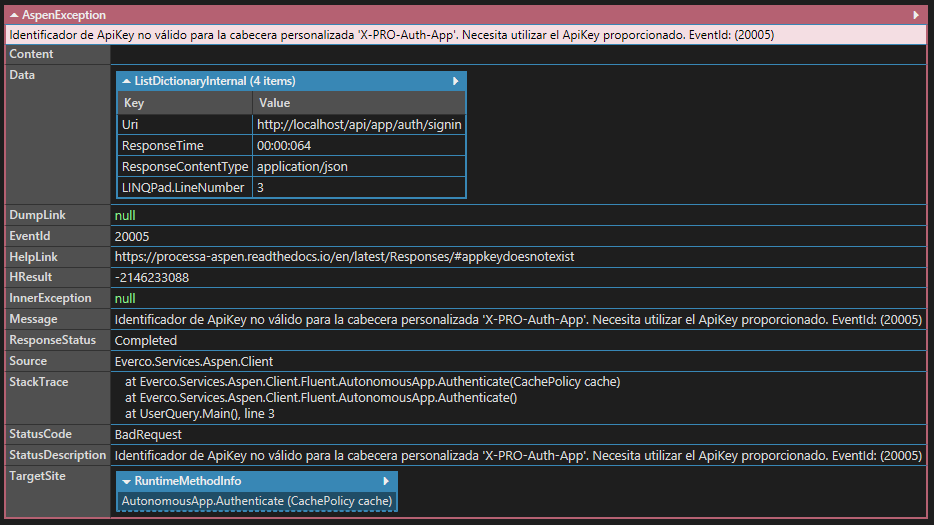

# Capturando excepciones

El cliente de ASPEN, está preparado para propagar una excepción de tipo: `AspenException` cuando se recibe una respuesta fuera del rango de códigos de estado HTTP `2xx` (indican que la solicitud del cliente se recibió, entendió y aceptó con éxito de acuerdo con la especificación **[RFC 2616](https://www.w3.org/Protocols/rfc2616/rfc2616-sec10.html)**) desde el API del servicio. Con la clase se asegura de recopilar y proporcionar la información relevante de la respuesta HTTP para cualquier operación implementada en el cliente que consuma un recurso del API de ASPEN.

Imaginemos con el siguiente ejemplo donde se intenta inicializar una instancia del cliente usando un **ApiKey** y un **ApiSecret** de un programa/aplicación desconocida.

```c#
var client = AutonomousApp.Initialize()
	.RoutingTo("http://localhost/api")
	.WithIdentity("00000000-0000-0000-0000-000000000000", "MySuperApiSecret")
	.Authenticate()
	.GetClient();
```

El resultado esperado debería ser una excepción de tipo `AspenException` ya que los valores que identifican a la aplicación son desconocidos para el sistema y la información de la respuesta HTTP inválida sería así:



## Message

Un mensaje personalizado que describirá el resultado de la operación; también incluye el identificador de evento con el formato: `EventId: (0000000)` que podría utilizar si necesita personalizar la respuesta.

## EventId

Un identificador de evento emitido para la respuesta inválida del servicio. Puede encontrar mayor detalle al respecto de los identificadores de eventos en la sección **[Mensajes de respuesta](https://processa-aspen.readthedocs.io/en/latest/Responses/)** de la documentación funcional del servicio.

## StatusCode

El código de estado de respuesta HTTP devuelto por el servicio.

## HelpLink

El enlace al archivo de ayuda en línea, asociado con la respuesta generada por el servicio.

## DumpLink

El enlace de la traza de seguimiento de la solicitud. Durante el procesamiento de una solicitud al API de ASPEN, se escriben trazas de seguimiento como las entradas recibidas y comportamientos esperados que permitirán verificar la respuesta generada por el servicio.