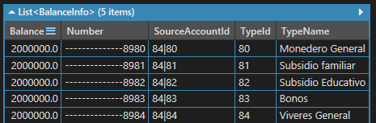

# Operaciones habilitadas en el cliente de Aspen

Ahora conozcamos las operaciones soportadas por el cliente de Aspen. Hemos ordenado por módulos las funcionalidades que pueden ser aprovechadas por su proyecto/aplicación asi:

## Configuraciones

Comprende a las operaciones soportadas para acceder a entidades de información relacionadas con parametrización del sistema, como son los tipos de documentos conocidos, tipos de transacción y valores de configuración disponibles para usar en su proyecto/aplicación.


## Consulta de productos financieros

En este módulo podrá realizar consultas a los productos financieros (cuentas débito y cuentas crédito) de un usuario.

### Cuentas asociadas a un usuario

Obtiene la información resumida de las cuentas o productos asociados al usuario especificando por el tipo y número de documento. Cuando el usuario no tiene productos asociados, la respuesta será una lista vacía.

```c#
string userDocType = "CC";
string userDocNumber = "0000000000";
client.Inquiries.GetAccounts(userDocType, userDocNumber);
``` 

El resultado de la consulta será una lista de elementos representados por la entidad `AccountInfo` asi:


#### Propiedades de una cuenta

Es un conjunto de propiedades o atributos que representan información adicional de la cuenta.

Campo | Descripción
:---: | -----------
Label | Nombre o etiqueta para visualizar el contenido del atributo en interfaz de usuario.
Key | Identificador interno del atributo.
Value | Valor asociado con el atributo.

<div class="admonition warning">
   <p class="first admonition-title">Atención</p>
   <p class="last">El conjunto de propiedades o atributos de una cuenta pueden variar de acuerdo con el sistema de origen del producto.</p>
</div>

#### Tipos de origen de los productos financieros

Nombre | Descripción
:----: | -----------
Tup | El origen de la información es el sistema de administración de tarjetas débito **TUP**.
Bancor | El origen de la información es sistema de administración de cartera **BANCOR**.
AMQP | La información la provee un sistema a través de una cola AMQP.
None | No hay un sistema definido. La información se puede utilizar con la finalidad de comprobar el funcionamiento del servicio, mientras se finalizan los acuerdos comerciales que permitan a los clientes del API, consumir la información real de los sistemas transaccionales.

### Saldos de una cuenta asociada a un usuario

Permite obtener los saldos (balances) detallados de una cuenta **débito** (TUP)

```c#
string userDocType = "CC";
string userDocNumber = "0000000000";
IList<AccountInfo> accounts = client.Inquiries.GetAccounts(userDocType, userDocNumber);

// Identifique la cuenta de origen de los saldos...
AccountInfo accountInfo = accounts.FirstOrDefault(account => account.Source == Subsystem.Tup);

// Y se espera el identificador de la cuenta para generar sus respectivos saldos.
string accountId = accountInfo.SourceAccountId;
client.Inquiries.GetBalances(userDocType, userDocNumber, accountId)
``` 

El resultado de la consulta será una lista de elementos representados por la entidad `BalanceInfo` asi:



### Movimientos financieros de una cuenta asociada a un usuario

Obtiene la información de transacciones finacieras realizadas en una cuenta.

```c#
string userDocType = "CC";
string userDocNumber = "0000000000";
IList<AccountInfo> accounts = client.Inquiries.GetAccounts(userDocType, userDocNumber);

// Identifique la cuenta de origen de los movimientos...
AccountInfo accountInfo = accounts.FirstOrDefault(account => account.Source == Subsystem.Tup);

// Se espera el identificador de la cuenta para generar sus respectivos movimientos.
string accountId = accountInfo.SourceAccountId;
client.Inquiries.GetStatements(userDocType, userDocNumber, accountId);
``` 

El resultado de la consulta será una lista de elementos representados por la entidad `MiniStatementInfo` asi:


## Operaciones dinámicas

Una operación dinámica en el servicio ASPEN, representa un endpoint de tipo REST que se conecta con una cola de RabbitMQ para procesar una operación. Esto facilita la flexibilidad del sistema al exponer operaciones a partir de verbos http específicos (GET, POST, PUT, DELETE)

### GET

```c#
client.Dynamics.Get("")
``` 

### POST

### PUT

### DELETE
