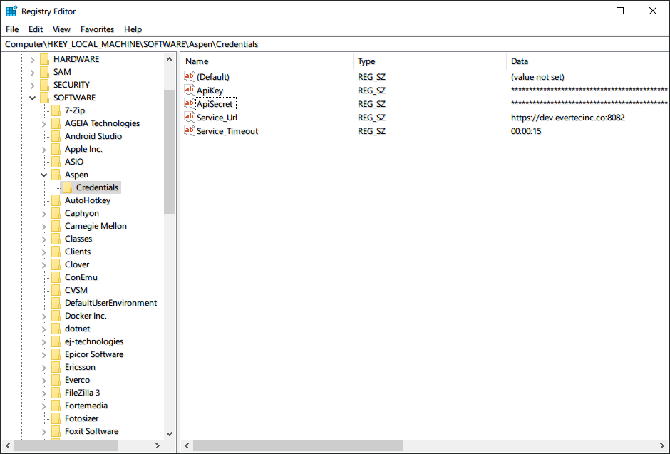

# RegistryEndpointProvider

Obtiene la Url base del servicio Aspen con el que se requiere conectar y el tiempo de espera para las respuestas a partir de la configuración en el registro de Windows.

El valor de la entrada **ASPEN:SERVICE_URL** debería tener la [forma de una URL](https://en.wikipedia.org/wiki/URL)

El valor de la entrada **ASPEN:SERVICE_TIMEOUT** debería corresponder con la forma `[ws][-]{ d | [d.]hh:mm[:ss[.ff]] }[ws]` como se describe [aquí](https://docs.microsoft.com/en-us/dotnet/api/system.timespan.parse). Por ejemplo, para especificar una espera de máximo 15 segundos en cada solicitud, el valor a configurar sería `00:00:15`.

## Ejemplo de la entrada en el registro de Windows


Tambien puede utilizar el constructor de la clase para personalizar el nombre de las entradas de configuración. Por ejemplo:

```c#
var provider = new RegistryEndpointProvider(RegistryRoot.LocalMachine, "SOFTWARE\Aspen\Credentials", "MyUrlKey", "MyTimeoutKey");
```

Para este caso se buscaran las entradas `MyUrlKey` y `MyTimeoutKey` en el registro de Windows bajo la clave `KEY_LOCAL_MACHINE\SOFTWARE\Aspen\Credentials` para asociar los valores con la Url del servicio y el tiempo de espera respectivamente. Luego, [registre la instancia para ser utilizada como extensión](ServiceLocator.md).


## Vea también

- [IEndpointProvider](IEndpointProvider.md)

- [EnvironmentEndpointProvider](EnvironmentEndpointProvider.md)

- [AppConfigEndpointProvider](AppConfigEndpointProvider.md)
